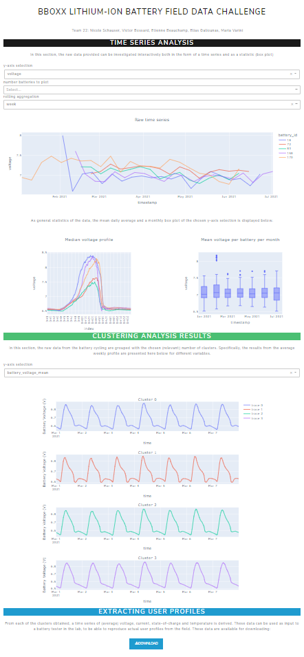

# BBoxx Lithium-Ion Battery Field Data Challenge
Data from off-grid Lithium-Ion Batteries in combination with solar panels operating in sub-Saharan Africa was analyzed as part of the [2022 BatteryDEV Hackathon](https://github.com/BatteryDEV/Field-Data-Challenge-Template-Public).

This repository provides the notebooks that were used to generate the results that are detailed in the [final report](https://github.com/BatteryDEV/dev22-team-eemnv/blob/main/README.md).

## Installation
To get started clone this repository and install the required packages.

```sh
$ git clone https://github.com/BatteryDEV/dev22-team-eemnv.git
$ set up the anaconda environment provided in the environment folder
$ pip3 install -r requirements.txt
```

## Usage
* The data can be retrieved from the [challenge repo](https://github.com/BatteryDEV/Field-Data-Challenge-Template-Public#data-files).
* It is essential to have the data already downloaded to run the code. The code doesn't include downloading functionality. The 4 csv files (devices1.csv, devices2.csv, devices3.csv, devices4.csv) must be placed in the data directory
* The [notebooks](https://github.com/BatteryDEV/dev22-team-eemnv/tree/main/notebooks) folder contains all the Jupyter Notebooks used during the event to process the data.
* To launch the dashboard run the notebook [Dashboard_full_t22.ipynb](https://github.com/BatteryDEV/dev22-team-eemnv/blob/main/notebooks/Dashboard_full_t22.ipynb). You will then be able to launch the dashboard localy from the generated link (it will appear at the end of the notebook)



## Details
All the code used for the competition is located in the [notebooks](https://github.com/BatteryDEV/dev22-team-eemnv/tree/main/notebooks) folder.
All notebooks should be self-sufficient, and each one will read its own data.
- The *cleaned_data* folder contains transfomred data used for some visualizations.
- The *plot_functions* folder contains all the graphical fucntions called by the dashboard during execution.
- The *Clustering-by-power-time-of-day-maps.ipynb* notebook was used to do some exploration, notably with PCA algorithms, which are detailed in the report.
- The *Dashboard_full_t22.ipynb* notebook contains the code for the interactive web page dashboard.
- The *Multivariate Time Series Clustering.ipynb* notebook contains code used to calculate the clusters using the temporal series.
- The *SoC-binned-PCA-and-clustering.ipynb* notebook hosts the code that was used to do anallysis on aggregation of the raw data, also detailed in the report.

## Credits
### Authors
* **[Étienne Beauchamp, CEP, M.A.Sc.](https://www.linkedin.com/in/beauchamp-etienne/)** - *Initial work* - [FinestStone](https://github.com/FinestStone)
* **[Victor Bossard](https://www.linkedin.com/in/victor-bossard/)** - *Initial work* - [victorbsrd](https://github.com/victorbsrd)
* **[Elias Galiounas CEng, MIMechE](https://www.linkedin.com/in/elias-galiounas/)** - *Initial work* - [EliasGaliounas](https://github.com/EliasGaliounas)
* **[Nicole Schauser](https://www.linkedin.com/in/nicoleschauser/)** - *Initial work*
* **[Maria Varini](https://www.linkedin.com/in/maria-varini-58696981/)** - *Initial work*


See also the list of [contributors](https://github.com/EliasGaliounas/BatteryDevBBoxx/graphs/contributors) who participated in this project.