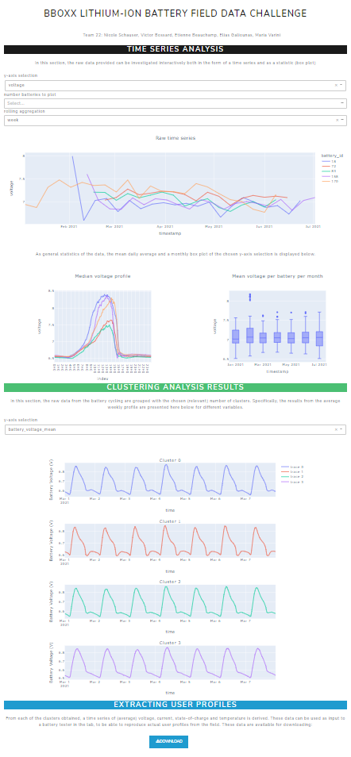

# BBoxx Lithium-Ion Battery Field Data Challenge
Data from off-grid Lithium-Ion Batteries in combination with solar panels operating in sub-Saharan Africa was analyzed as part of the [2022 BatteryDEV Hackathon](https://github.com/BatteryDEV/Field-Data-Challenge-Template-Public).

This repository provides the notebooks that were used to generate the results that are detailed in the [final report]().

## Installation
To get started clone this repository and install the required packages.

```sh
$ git clone https://github.com/EliasGaliounas/BatteryDevBBoxx
$ pip3 install -r requirements.txt
```

## Usage
* The data can be retrieved from the [challenge repo](https://github.com/BatteryDEV/Field-Data-Challenge-Template-Public#data-files).
* The [notebooks](https://github.com/EliasGaliounas/BatteryDevBBoxx/tree/main/notebooks) folder contains all the Jupyter Notebooks used during the event to process the data.
* To launch the dashboard run the notebook [1.Dataload.ipynb](https://github.com/EliasGaliounas/BatteryDevBBoxx/blob/etienne_exploration/dashboard/1.Dataload.ipynb) notebook, followed by [2.Dashboard_full_t22.ipynb](https://github.com/EliasGaliounas/BatteryDevBBoxx/blob/etienne_exploration/dashboard/2.Dashboard_full_t22.ipynb). You will then be able to launch the dashboard localy from the generated link.



## Credits
### Authors
* **[Étienne Beauchamp, CEP, M.A.Sc.](https://www.linkedin.com/in/beauchamp-etienne/)** - *Initial work* - [FinestStone](https://github.com/FinestStone)
* **[Victor Bossard](https://www.linkedin.com/in/victor-bossard/)** - *Initial work* - [victorbsrd](https://github.com/victorbsrd)
* **[Elias Galiounas CEng, MIMechE](https://www.linkedin.com/in/elias-galiounas/)** - *Initial work* - [EliasGaliounas](https://github.com/EliasGaliounas)
* **[Nicole Schauser](https://www.linkedin.com/in/nicoleschauser/)** - *Initial work*
* **[Maria Varini](https://www.linkedin.com/in/maria-varini-58696981/)** - *Initial work*


See also the list of [contributors](https://github.com/EliasGaliounas/BatteryDevBBoxx/graphs/contributors) who participated in this project.